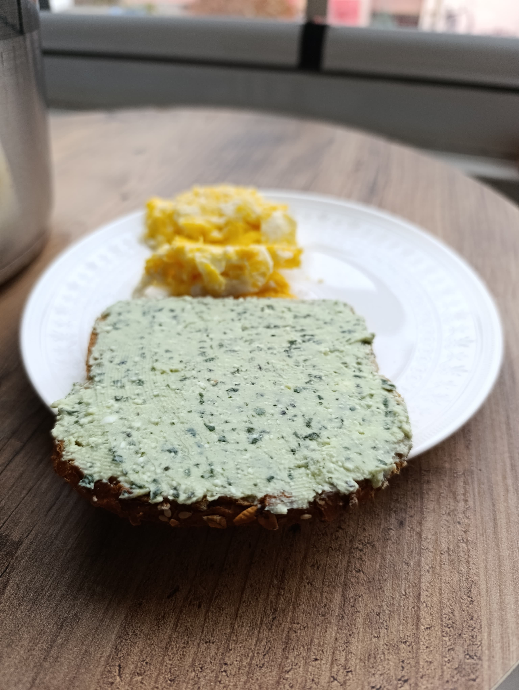
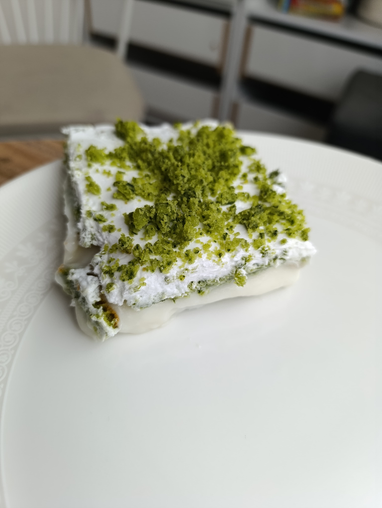
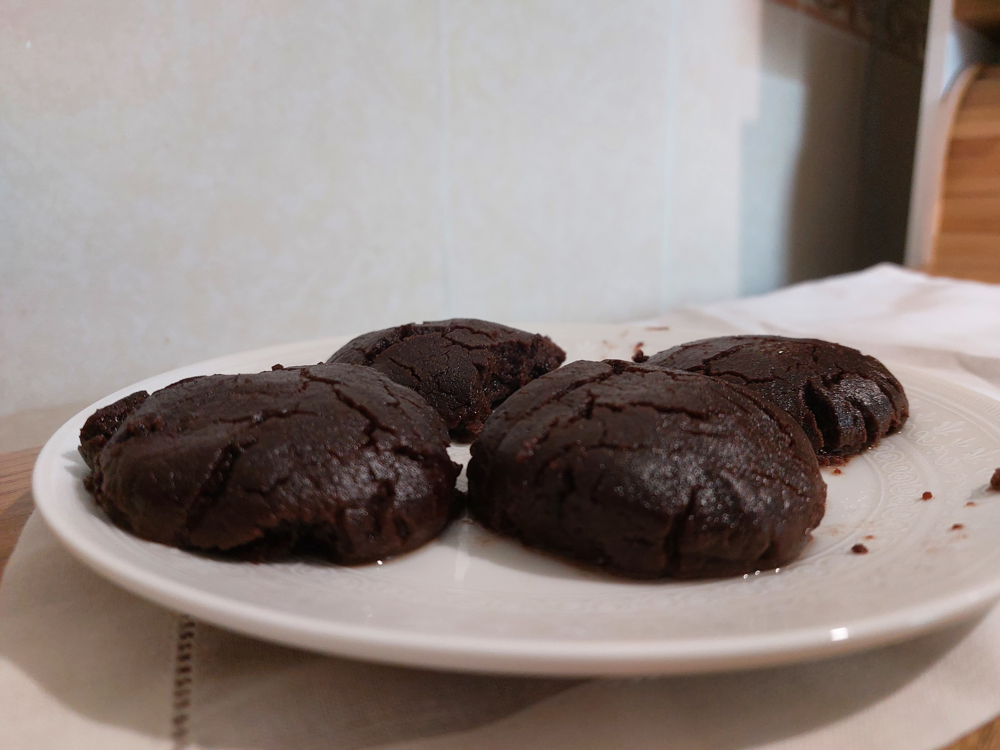

# İçindekiler

1.  [Et Yemekleri](#org44bb636)
    1.  [Soğan Kebabı](#orge99e89f)
2.  [Tavuk Yemekleri](#org3c92187)
    1.  [Kayısı Marmelatlı Tavuk](#org6363ee8)
    2.  [Soya Soslu Sebzeli Tavuk](#org8fa8811)
3.  [Kahvaltılıklar](#org68d7187)
    1.  [Füme Kaburga Ve Cheddarlı Yumurta Dolması](#orgd8d254f)
    2.  [Avokadolu Yumurta Dolması](#org9957d80)
    3.  [Fesleğenli Krem Peynir](#orge7deef1)
4.  [Makarnalar](#orgc754e4c)
    1.  [Domates ve Fesleğenli Makarna](#org34d3bf4)
5.  [Tatlılar](#orgaf57eb0)
    1.  [Frambuazlı Yaş Pasta](#org89b3fe6)
    2.  [Leblebili Kurabiye](#org0238407)
    3.  [San Sebastian Cheesecake](#org81c7e81)
    4.  [Bisküvili Çikolata Topları](#org8e98585)
    5.  [Kıtır Karpuz Kabuğu Tatlısı](#orgcbeae93)
    6.  [Ispanaklı Pasta](#org67458cb)
    7.  [Şerbetli Çatlak Kurabiye](#org1895441)
6.  [Hamur İşleri](#org8191a23)
    1.  [Beyaz Ekmek](#org1496aec)
    2.  [Taze Makarna](#org2a53519)

# Et Yemekleri

## Soğan Kebabı

-   Zorluk: Orta

### Besin Değerleri

Bir porsiyonda (tarifin tamamı 5 porsiyon):

-   605 kcal
-   18 g protein
-   35 g karbonhidrat
-   43 g yağ

### Malzemeler

-   1 kg arpacık soğan
-   500 g kıyma (mümkünse kuzu)
-   Yarım çay bardağı zeytinyağı
-   Yarım çay bardağı nar ekşisi
-   1 su bardağı su
-   Karabiber
-   Pul biber
-   Tuz

### Tarif

-   Kıymayı baharatlarla birlikte yoğur.
-   Soğanların iki başını kes, kabuğunun bir katını soy.
-   Soğanları yarısına kadar bıçakla kes.
-   Kesilen boşluğa kıymadan doldurup tepsiye diz.
-   Bir kasede nar ekşisi, zeytinyağı ve suyu karıştırıp tepsiye gezdir.
-   200°C fırında 1 saat pişir.

# Tavuk Yemekleri

## Kayısı Marmelatlı Tavuk

-   Zorluk: Kolay

### Besin Değerleri

Bir parçada (tarifin tamamı 12 parça):

-   159 kcal
-   22 g protein
-   3 g karbonhidrat
-   5 g yağ

### Malzemeler

-   12 tavuk kalça
-   9 yemek kaşığı kayısı marmelatı
-   3 yemek kaşığı soya sosu
-   1.5 yemek kaşığı hardal
-   2 diş sarımsak
-   1 çay kaşığı tuz
-   1 çay kaşığı karabiber

### Tarif

-   Tavukları fırın tepsisine diz.
-   Sos için tüm malzemeleri karıştır.
-   Sosu 5 6 dakika orta ateşte karıştırarak kaynat.
-   Sosu fırındaki tavukların üzerine paylaştır.
-   220°C fırında 40 dakika pişir.
-   10 dakikada bir fırını açıp dibindeki sosu tavukların üzerine dökerek tavukları ıslat.

## Soya Soslu Sebzeli Tavuk

-   Zorluk: Kolay

### Besin Değerleri

Bir porsiyonda (tarifin tamamı 5 porsiyon):

-   252 kcal
-   36 g protein
-   12 g karbonhidrat
-   7 g yağ

### Malzemeler

-   500 g tavuk göğsü
-   4 yemek kaşığı + 2 yemek kaşığı soya sosu
-   3 yemek kaşığı sirke
-   2 yemek kaşığı nişasta
-   1 kabak
-   1 kapya biber
-   500 g mantar
-   1 yemek kaşığı sıvı yağ

### Tarif

-   Tavuğu kuşbaşı doğra.
-   Tavuğu nişasta, 4 yemek kaşığı soya sosu ve sirke ile karıştırıp buzdolabında birkaç saat beklet.
-   Tavada yağı kızdırıp tavukları ekle.
-   Tavuklar suyunu çekene kadar karıştırarak pişir.
-   Kabakları ve biberleri jülyen doğrayıp tavuklara ekle, bir süre pişir.
-   Sebzelerle birlikte 2 yemek kaşığı soya sosu ekle.
-   Mantarları söğüş doğrayıp tavuklara ekle, fazla öldürmeden pişir.

# Kahvaltılıklar

## Füme Kaburga Ve Cheddarlı Yumurta Dolması

-   Zorluk: Orta

### Besin Değerleri

Bir parçada (yarım yumurta):

-   112 kcal
-   8 g protein
-   1 g karbonhidrat
-   8 g yağ

### Malzemeler

-   3 yumurta
-   3 yemek kaşığı ekşi krema
-   Yarım su bardağı ince dilimlenmiş füme kaburga
-   Yarım su bardağı rendelenmiş cheddar
-   Taze soğan
-   Tuz
-   Karabiber

### Tarif

-   Yumurtaları yaklaşık 7 dakika tuzlu suda haşla.
-   Haşlanan yumurtaları buzlu suyun içine atarak soğut.
-   Haşlanan yumurtaları soy.
-   Yumurtaları ikiye bölüp sarılarını kapta biriktir.
-   Yumurta sarılarını çatalla iyice ez.
-   Yumurta sarılarının üzerine ekşi krema, tuz, karabiber ekleyip iyice karıştır.
-   Üzerine füme kaburga, cheddar ve taze soğanı ekleyip hafifçe karıştır.
-   Karışımı sıkma torbasına doldurup yumurta beyazlarının içine sık.

## Avokadolu Yumurta Dolması

-   Zorluk: Orta

### Besin Değerleri

Bir parçada (yarım yumurta):

-   73 kcal
-   4 g protein
-   2 g karbonhidrat
-   5 g yağ

### Malzemeler

-   3 yumurta
-   Çeyrek büyük boy avokado
-   10 dilim jalapeno turşusu
-   Çeyrek küçük kırmızı soğan (ince dilimlenmiş)
-   Çeyrek domates (ince dilimlenmiş)
-   1 diş sarımsak (ezilmiş)
-   1 çay kaşığı kimyon
-   1 yemek kaşığı limon suyu
-   Tuz

### Tarif

-   Yumurtaları yaklaşık 7 dakika tuzlu suda haşla.
-   Haşlanan yumurtaları buzlu suyun içine atarak soğut.
-   Haşlanan yumurtaları soy.
-   Yumurtaları ikiye bölüp sarılarını kapta biriktir.
-   Yumurta sarılarına avokadoyu ve sarımsağı ekleyip çatalla iyice ez.
-   Üzerine jalepeno, soğan ve domatesi ekleyip hafifçe karıştır.
-   Karışımı sıkma torbasına doldurup yumurta beyazlarının içine sık.

## Fesleğenli Krem Peynir

-   Zorluk: Kolay

### Besin Değerleri

100 g üründe:

-   205 kcal
-   15 g protein
-   3 g karbonhidrat
-   15 g yağ

### Malzemeler

-   300 g yumuşak beyaz peynir (süzme peynir veya ekici)
-   100 g lor peyniri
-   1 bağ fesleğen
-   1 tatlı kaşığı zeytinyağı

### Tarif

-   Fesleğenleri yıkayıp yaprakları ayıkla.
-   Fesleğen yapraklarını zeytinyağı ile birlikte robottan geçir.
-   Lor peynirini ekleyip tekrar robottan geçir.
-   Beyaz peyniri istenen aroma ve kıvam elde edilene kadar yavaş yavaş ekleyip robottan geçir.

# Makarnalar

## Domates ve Fesleğenli Makarna

-   Zorluk: Orta

### Malzemeler

-   Haşlanmış makarna
-   1 yemek kaşığı tereyağı
-   1 domates
-   1 yemek kaşığı domates salçası
-   1 tatlı kaşığı biber salçası
-   1 tatlı kaşığı kuru fesleğen
-   1 çay kaşığı pul biber
-   Yarım çay kaşığı karabiber
-   Tuz

### Tarif

-   Domatesi rendele.
-   Tereyağını tavada erit.
-   Eriyen tereyağının üzerine salçaları ekleyip bir süre kavur.
-   Rendelenmiş domatesi ekleyip karıştır.
-   Domatesin diriliği gidip suyu azalana kadar arada karıştırarak kavur.
-   Baharatları ekleyip bir süre de baharatlarla kavur.
-   Baharatların kokusu çıkıp sosun suyu iyice azalınca makarnanın haşlandığı sudan ilave ederek
    kıvamını ayarla.
-   İstenen kıvama gelip kaynayan sosa suyu süzülen makarnaları ekle.
-   Haşlanıp süzülen makarnaları iyice sos ile harmanla.

# Tatlılar

## Frambuazlı Yaş Pasta

-   Zorluk: Zor

### Besin Değerleri

Bir dilimde (tüm tarif 8 dilim):

-   786 kcal
-   12 g protein
-   81 g karbonhidrat
-   48 g yağ

### Malzemeler

1.  Kek

    -   150 g tereyağı
    -   300 g toz şeker
    -   210 g un
    -   50 g kakao
    -   1 yemek kaşığı granül kahve
    -   160 ml sıcak su
    -   70 g yoğurt
    -   3 adet orta boy yumurta
    -   1 çay kaşığı kabartma tozu
    -   Bir tutam tuz

2.  Krema

    -   400 ml krema
    -   200 g bitter çikolata
    -   300 g frambuaz (tahmini)

3.  Ganaj

    -   50 ml krema
    -   50 g bitter çikolata

### Tarif

1.  Kekin Hazırlanması

    -   Kahve, kakao ve sıcak suyu iyice çözünene kadar karıştır.
    -   Karışımı soğumaya bırak.
    -   Tereyağını şeker ile birlikte çırp.
    -   Yumurtaları tek tek ekle, her yumurtadan sonra yeniden çırp.
    -   Tuz, kabartma tozu ve unun yaklaşık yarısını ekleyip tekrar çırp.
    -   Yoğurt ve kahveli karışımın yarısını ekleyip tekrar çırp.
    -   Kalan unu ekleyip tekrar çırp.
    -   Kalan kahveli karışımı ekleyip tekrar çırp.
    -   20 cm çapındaki i̇ki çember kalıba keki bölüştür.
    -   175°C fırında 25-30 dk pişir.

2.  Kremanın Hazırlanması

    -   Çikolatayı parçalayarak bir kaba al.
    -   200 ml kremayı (yarısını) sos tenceresinde kaynat.
    -   Kaynayan kremayı çikolataların üzerine döküp karıştır.
    -   Kalan soğuk kremayı ekleyip tekrar karıştır.
    -   Streç film ile üzerini kapatıp en az 4 saat dolapta beklet.
    -   Dolaptan çıkan kremayı mikserle iyice çırparak kıvamlandır.

3.  Pastanın Oluşturulması

    -   Pişip soğuyan keklerin yüksek kalan yerlerini bıçakla düzleşt.
    -   Pasta standına bir parça krema koyarak üstüne pastanın alt tabanını yerleştir.
    -   Üzerine krema torbasına doldurulmuş kremanın bir kısmını sık. Krema torbası yerine spatula
        ile de sürülebilir.
    -   Sıkılan kremanın üzerine frambuaz serpiştir.
    -   Frambuazların bir kısmını üstünü süslemek için ayır.
    -   Frambuazların üstüne bir miktar daha krema ekleyerek frambuazları göm.
    -   Diğer kek parçasını üzerine kapat.
    -   Bir miktar kremayı süsleme için ayır.
    -   Kalan kremayla pastanın üstünü ve yanlarını iyice sıva.
    -   Pastayı buzdolabında iyice soğutup servis tabağına al.

4.  Ganajın Hazırlanması

    -   Çikolatayı parçalayarak bir kaba al.
    -   Kremayı sos tenceresinde kaynat.
    -   Kaynayan kremayı çikolataların üzerine döküp karıştır.
    -   Soğuyan pastanın kenarlarından aşağı doğru akan bir görünüm sağlayacak şekilde pastanın
        kenarlarından akıt.
    -   Kalan ganajı pastanın üzerine dökerek üst yüzeyini tamamen kapla.
    -   Tabağı tezgahın üstüne vurarak pürüzsüz olmasını sağla.
    -   Pastayı buzdolabında soğumaya bırak.

5.  Süsleme

    -   Soğuyup ganajı tamamen donan pastanın üzerine krema torbasının şekilli ucu ile krema
        yığınları yaparak süsle.
    -   Her krema yığının üzerine bir adet frambuaz ekle.

## Leblebili Kurabiye

TODO: oranlar güncellenecek

-   Zorluk: Orta

### Besin Değerleri

TODO

### Malzemeler

-   1.5 su bardağı leblebi tozu
-   1 su bardağı pudra şekeri
-   1 su bardağı sıvı yağ
-   1 su bardağı un

### Tarif

-   Leblebi tozu yoksa sarı leblebileri robotta un haline getir.
-   Leblebi tozu, sıvı yağ ve pudra şekerini iyice karıştır.
-   Karışımın üzerine azar azar un ekleyerek yavaş yavaş yoğur (Un miktarı değişebilir).
-   Yağlı kağıt serili tepsi üzerine dondurma kaşığı ile şekil vererek diz.
-   180°C fırında 10-15 dakika kontrollü pişir. Hala yumuşakken alınması gerekiyor. Fırından çıkınca sertleşiyor.

## San Sebastian Cheesecake

-   Zorluk: Kolay

### Besin Değerleri

Bir dilimde (tüm tarif 8 dilim):

-   507 kcal
-   9 g protein
-   33 g karbonhidrat
-   38 g yağ

### Malzemeler

-   400 g Pınar Beyaz
-   200 g Labne
-   1 su bardağından biraz fazla şeker (200 g)
-   4 yumurta
-   2 yemek kaşığı un
-   400 ml krema

### Tarif

-   Beyaz peynir, labne ve şekeri şekerin çıtırlığı gidene kadar çırp.
-   Yumurtaları teker teker ekleyerek çırp.
-   Unu ekleyip çırp.
-   Krema ekleyip çırp.
-   Kalıbı yağlı kağıt ile kapla.
-   Hamuru kalıba dök.
-   200°C fırında 45 dakika pişir.
-   Süre dolduğunda fırını kapatıp, kapağını açıp 1 saat soğumaya bırak.

## Bisküvili Çikolata Topları

-   Zorluk: Kolay

### Besin Değerleri

TODO

### Malzemeler

-   2 paket pötibör (300 g)
-   150 g margarin
-   Yarım su bardağı şeker
-   Yarım su bardağı süt
-   2 tatlı kaşığı kakao
-   Hindistan cevizi

### Tarif

-   Küçük tencerede margarini erit.
-   Süt ve şekeri ekleyip karıştır.
-   Ocaktan alıp ılıt.
-   Bisküvileri çok küçük olmayacak şekilde elle kır.
-   İçine kakaoyu ekleyip karıştır.
-   Karışımı kakaoların üzerine dök.
-   Erimeyen bir kıvama gelene kadar yoğur.
-   Elle yuvarlayıp şekil ver.
-   Hindistan cevizine bula.
-   Buzdolabında en az bir saat soğut.

## Kıtır Karpuz Kabuğu Tatlısı

-   Zorluk: Orta

### Malzemeler

-   1 kg karpuz kabuğu
-   1 kg toz şeker
-   1 limon
-   2 su bardağı su
-   10 adet karanfil
-   1 tatlı kaşığı karbonat

### Tarif

-   Karpuz kabuklarının kırmızı ve yeşil kısımlarını soy.
-   Kabukları küp küp doğra.
-   Karbonatlı su içinde bir gece beklet.
-   Karbonatlı suyu süzüp yıka.
-   Yeniden su ekleyip 5 dk kaynat.
-   Yeniden suyunu süz.
-   Tencerede su, şeker ve limonutencereye alıp kaynat.
-   Kaynadıktan ve şeker çözündükten sonra karpuz kabuklarını ve karanfilleri ekleyerek kaynatmaya devam et.
-   Yarım saat kaynadıktan sonra soğumaya bırak.
-   Soğuduktan sonra tekrar suyunu iyice çekene kadar kaynat.

## Ispanaklı Pasta

-   Zorluk: Orta

### Besin Değerleri

Bir dilimde (tüm tarif 15 dilim):

-   425 kcal
-   10 g protein
-   68 g karbonhidrat
-   13 g yağ

### Malzemeler

1.  Kek Malzemeleri

    -   400 g ıspanak
    -   4 adet yumurta
    -   1 su bardağı şeker
    -   1 + 1 su bardağı süt
    -   Yarım su bardağı sıvı yağ
    -   1 paket kabartma tozu
    -   1 paket vanilya
    -   3.5 su bardağı un

2.  Krema Malzemeleri

    -   1 litre süt
    -   1 su bardağı şeker
    -   4 yemek kaşığı un
    -   4 yemek kaşığı nişasta
    -   1 yemek kaşığı tereyağı
    -   1 paket vanilya
    -   1 paket krem şanti

3.  Üst Katman Malzemeleri

    -   1 paket krem şanti
    -   Yarım su bardağı süt

### Tarif

1.  Kekin Hazırlanması

    -   Ispanakların yapraklarını ayıkla ve yıka.
    -   Ispanak yapraklarını bir bardak süt ile birlikte robottan geçir.
    -   Yumurta ve şekeri ayrı bir çırpma kabında çırp.
    -   Sıvı yağı, kalan bir bardak sütü ve çekilmiş ıspanakları ekleyip tekrar çırp.
    -   Un, kabartma tozu, vanilya ekleyip karıştır.
    -   Kek hamurunu borcama dök.
    -   180°C fırında 40-45 dk pişir.

2.  Kremanın Hazırlanması

    -   Süt, şeker, un nişastayı orta ateşte karıştırarak pişir.
    -   Kıvam alınca tereyağı ve vanilyayı ekleyip karıştır.
    -   Kremayı soğumaya bırak.
    -   Soğuyan kremaya krem şanti ekleyip iyice çırp.

3.  Üst Katmanın Hazırlanması

    -   Krem şantiyi soğuk süt ile birlikte iyice kıvam alana kadar çırp.

4.  Pastanın Oluşturulması

    -   Soğuyan keki borcamdan çıkarıp yatay olarak ikiye böl.
    -   Katmanlardan fazla kek parçalarını çıkartarak ayır.
    -   Katmanları düzgün bir hale getir.
    -   Alt kek katmanını tekrardan borcama al.
    -   Üzerine kremayı döküp iyice yay.
    -   Üzerine ikinci kek katmanını yerleştir.
    -   Üzerine üst katman için hazırlanan krem şantiyi döküp yay.
    -   Ayrılan kek parçalarını robottan geçirerek ufala.
    -   Ufalanan kek parçalarını en üste serpiştir.

## Şerbetli Çatlak Kurabiye

-   Zorluk: Kolay

### Besin Değerleri

Bir kurabiyede (tüm tarif 23 kurabiye):

-   160 kcal
-   2 g protein
-   21 g karbonhidrat
-   8 g yağ

### Malzemeler

1.  Şerbet

    -   2 su bardağı su
    -   1 su bardağı şeker

2.  Kurabiye

    -   1 yumurta
    -   1 çay bardağı sıvı yağ
    -   1 çay bardağı pudra şekeri
    -   125 g tereyağı veya margarin
    -   1 paket kabartma tozu
    -   1 paket vanilya
    -   3 su bardağı un
    -   3 yemek kaşığı kakao

### Tarif

-   Şerbet malzemelerini karıştır.
-   Şerbeti 5 dk kaynatıp soğumaya bırak.
-   Yoğurma kabında tereyağı, pudra şekeri ve yumurtayı karıştır.
-   Sıvı yağı ekleyip karıştırmaya devam et.
-   Un, kabartma tozu, vanilya ve kakao ekleyip iyice yoğur.
-   Hamurdan parçalar koparıp kurabiye şekli vererek fırın tepsisine diz.
-   200°C fırında 12 dk, üzerleri çatlayana kadar pişir.
-   Kurabiyeleri fırından alıp 2-3 dk ilk sıcağı geçene kadar beklet.
-   Kurabiyeleri tek tek ılıyan şerbete daldırıp çıkarıp borcama diz.
-   Kalan şerbeti kurabiyelerin üzerine gezdir.

# Hamur İşleri

## Beyaz Ekmek

-   Zorluk: Orta

### Malzemeler

-   500 g un
-   300 ml ılık su
-   1 paket yaş maya
-   1 tatlı kaşığı tuz
-   Susam

### Tarif

-   El yakmayacak sıcaklıkta ılık suyu, yaş maya ile karıştırarak 10 dakika beklet.
-   Oda sıcaklığındaki un ve tuzu yoğurma kabına ekleyip ortasını çukurlaştır.
-   Çukurun ortasına bekletilmiş mayalı suyu ilave et.
-   Kaşıkla ortadan dışlara doğru karıştır.
-   Elle yoğurmaya devam et.
-   İyice yoğurulduktan sonra kapağını kapatıp mayalanma için battaniyeye sar.
-   Sıcak bir yerde en az 1, en fazla 4 saat mayalanmaya bırak.
-   Mayalanıp kabaran hamuru tekrar yoğurarak havasını al.
-   Hamuru hafif unlanmış tezgaha al.
-   Hamuru istenen büyüklükte bezelere ayır.
-   Hamura ekmek şeklini verip tepsiye yerleştir.
-   Üzerlerine bıçakla çizikler at.
-   Üzerine fırça ile su veya yoğurt sür.
-   Üzerine susam serp.
-   Üzerini mutfak bezi ile örtüp 20 dk sıcak bir yerde tekrar mayalanmaya bırak.
-   Fırının nemli olması için içine ısıya dayanıklı bir kapta su koyup fırını 200°C'ye ısıt.
-   Bekleyen hamurların üzerini açıp fırında yaklaşık 20 dk pişir.

## Taze Makarna

-   Zorluk: Kolay

### Malzemeler

-   100 g un
-   1 yumurta
-   1 tatlı kaşığı tuz

### Tarif

-   Hamurun açılacağı tezgaha elenmiş unu tepe şeklinde dök.
-   Üzerine tuzu ekle.
-   Tepenin ortasında bir çukur oluştur.
-   Çukurun içine yumurtayı kır.
-   Spatulayla hamur biraz toparlanana kadar karıştır.
-   Hamur biraz toparlandıktan sonra elle yoğurmaya başla.
-   Sert ama dağılmayan bir hamur elde edene kadar yoğur.
-   Eğer hamur cıvık olursa kontrollü şekilde elenmiş un ekle.
-   Eğer hamur fazla sert ve yoğururken dağılan bir kıvamda olursa elini hafifçe ıslatıp yoğurmaya
    devam et.
-   İstenen kıvama gelen hamuru üzerini kapatarak oda sıcaklığında yarım saat dinlendir.
-   Hamuru açmaya başlamadan önce tencerede bir miktar suyu kaynamaya al.
-   Dinlenen hamuru iki eşit parçaya böl.
-   Tezgahın üstüne hafifçe un serpip parçalardan birini üstüne al.
-   Hamur parçasının üzerine de bir miktar un serpip merdane ile açmaya başla.
-   İnce ve uzun bir dikdörtgen elde edecek şekilde hamuru incelterek aç.
-   Açarken ara ara hamuru ters yüz edip hafifçe un serp.
-   Hamur istenen kalınlık ve uzunluğa geldiğinde hamurun iki yüzüne hafifçe un serpip elle
    hafifçe dağıt. Bu katlanan hamurun diğer katlara yapışmaması için gerekli.
-   Dikdörtgen şeklindeki hamuru bıçakla kesebilmek için birkaç kat katla.
-   Katladığın hamuru bıçakla fazla dağıtmamaya ve hamurları birbirine yapıştırmamaya gayret
    göstererek kes.
-   Kesilen ve katlı durumda olan makarnaları açarak tek bir uzun şerit haline getir.
-   Aynı işlemleri tüm hamur bezeleri için tekrarla.
-   Hazırladığın makarnaları kaynamakta olan suyun içine at.
-   Makarnaları 5-6 dakika haşla.
-   Haşlanan makarnaları süzgeç içine koyup süz.
-   Herhangi bir sos ile soslayarak servis et.

